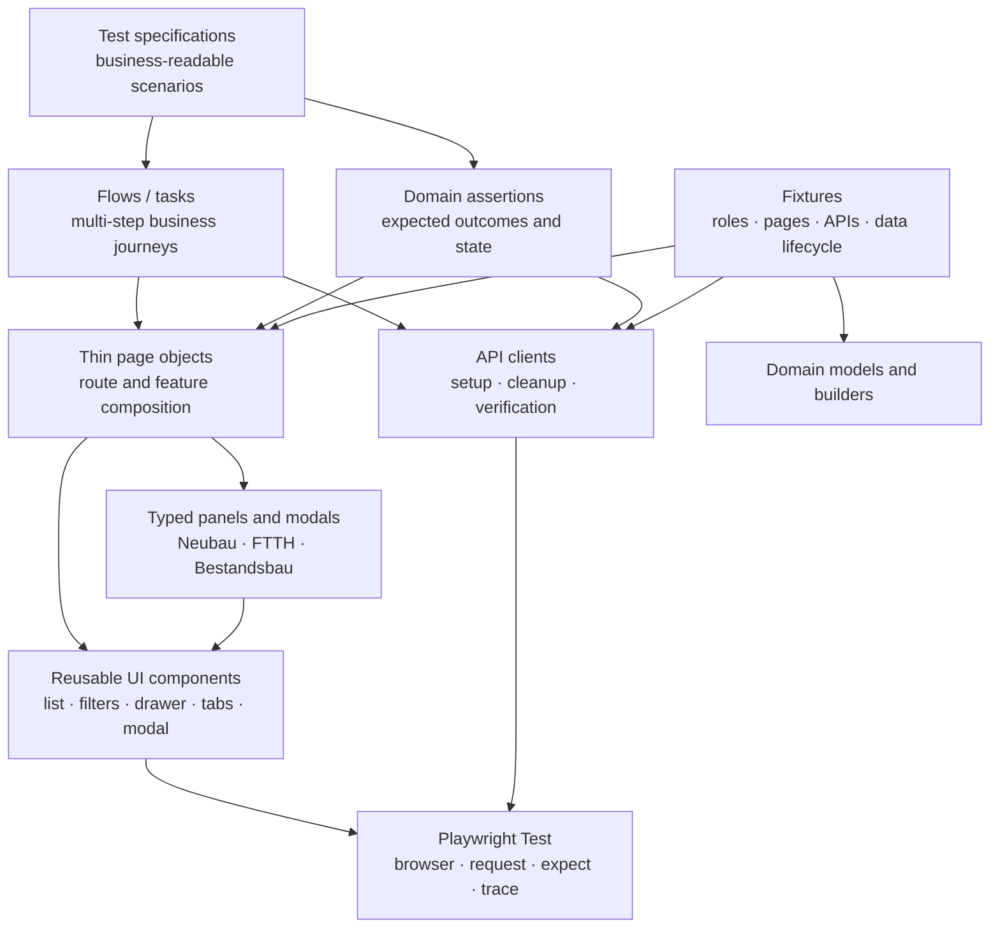

# Door 2 Door automation framework proposal

## Recommendation

Use **Playwright Test + TypeScript (strict mode)** as one repository for UI, API, accessibility, authentication setup, reporting, and CI execution.

Do **not** begin with Cucumber, a large inheritance-based `BasePage`, or a generic `helpers/` dumping ground. For this application, the clearest maintainable design is:

1. reusable UI component objects;
2. thin page objects that compose those components;
3. typed drawer/modal objects for Neubau, FTTH-Ausbau, and Bestandsbau;
4. business-flow classes for multi-step journeys;
5. API clients and data builders for setup, cleanup, and server-side verification;
6. fixtures for dependency injection, authentication, roles, and lifecycle;
7. readable specs using `test.step()` and domain language.

Playwright is a strong fit because it combines isolated browser contexts, fixtures, reusable authentication state, resilient locators, API request contexts, parallel projects, traces, and built-in reporting. Its official guidance recommends user-facing locators, isolated tests, web-first assertions, TypeScript/linting, and sharding for larger CI suites: [Playwright best practices](https://playwright.dev/docs/best-practices), [fixtures](https://playwright.dev/docs/test-fixtures), [API testing](https://playwright.dev/docs/api-testing), [authentication](https://playwright.dev/docs/auth), and [projects](https://playwright.dev/docs/test-projects).

## Why this design matches the inspected application

The exploration artifacts show several repeated mechanisms and several intentionally different domain variants:

- Baulose, Objekte, Sales Action, Benutzerverwaltung, and Importe all use list/table views, but their row interactions differ.
- Baulose rows are not directly clickable; `zu Sales Actions` performs the transition.
- Objekte supports both direct item clicks and three-dot context menus.
- Sales Action items open different drawers for Neubau, FTTH-Ausbau, and Bestandsbau.
- The activity modal has four Neubau outcomes, eleven FTTH outcomes, and three Bestandsbau outcomes.
- Shared filter bars include horizontally hidden filters, popovers, chips, reset actions, and `Alle Filter` overlays.
- Drawers contain tabs, edit controls, assignment controls, notes, activities, documents, order status, and embedded portal widgets.
- Some controls are symbol-only or have duplicate/weak accessible names.
- Filters can persist between routes, lists use loading skeletons, and large datasets are paginated.
- Administration, imports, configuration, orders, appointments, rejection, and activity creation contain mutating operations that need controlled test data and cleanup.

The detailed application shape is documented in the [application map](./application-map.mmd), [findings](./findings.md), and [97-state raw DOM manifest](./raw-dom/README.md).

## Layer model



### 1. Configuration layer

Responsibilities:

- validated environment variables;
- UI and API base URLs;
- integration/test environment guards;
- timeouts and artifact policies;
- browser and role projects;
- mutation safety switches.

Use a typed `env.ts` that fails immediately when a required variable is missing. Never read `process.env` throughout the framework.

### 2. Domain layer

Keep business vocabulary independent of Playwright:

```ts
export type ObjectType = 'NEUBAU' | 'FTTH_AUSBAU' | 'BESTANDSBAU';

export interface SalesActionRef {
  id: string;
  type: ObjectType;
  address: string;
  salesActionType: string;
}
```

This layer contains enums, interfaces, expected outcome catalogues, builders, and test-data references. It must not contain locators.

### 3. Reusable UI component layer

This is the most important layer for maintainability. Build components around repeated interaction patterns, not around HTML tags:

- `AppShell`
- `SearchBox`
- `HorizontalFilterBar`
- `FilterPopover`
- `AllFiltersModal`
- `DataListView`
- `ListRow`
- `RowContextMenu`
- `SidePanel`
- `TabStrip`
- `ModalDialog`
- `Pagination`
- `LoadingSkeleton`
- `AssignmentEditor`
- `ActivityModal`
- `EmbeddedWidgetHost`

Example responsibility split:

```ts
class DataListView {
  itemByBusinessKey(key: string): ListRow;
  waitUntilLoaded(): Promise<void>;
  expectResultCount(count: number): Promise<void>;
}

class ListRow {
  openDirectly(): Promise<void>;
  openContextMenu(): Promise<RowContextMenu>;
  clickAction(name: string): Promise<void>;
}
```

`DataListView` owns list loading and row discovery. It must not know what a Neubau activity outcome means.

### 4. Page-object layer

Page objects should be thin compositions of components:

- `BaulosePage`
- `ObjektePage`
- `SalesActionsPage`
- `UserAdministrationPage`
- `ImportsPage`
- `ConfigurationPage`

They own:

- route navigation;
- page-specific sections;
- component composition;
- feature-level readiness checks.

They should not contain full end-to-end scenarios or large assertion blocks.

### 5. Typed panel and modal layer

Avoid one side-panel class containing dozens of optional methods and `if (type === ...)` branches.

Use a shared base plus explicit variants:

```text
BaseObjectPanel
├── NeubauObjectPanel
├── FtthObjectPanel
└── BestandsbauObjectPanel

BaseSalesActionPanel
├── NeubauSalesActionPanel
├── FtthSalesActionPanel
└── BestandsbauSalesActionPanel
```

Examples:

- `NeubauObjectPanel` exposes questionnaire and Objekt Sales Action sections.
- `FtthSalesActionPanel` exposes Planskizze, Bestellung, Termin, Dokumente, and Bestellstatus.
- `BestandsbauSalesActionPanel` exposes its order, appointment, activity, and assignment flows.

This makes invalid operations impossible or obvious during code review.

### 6. Flow/task layer

Flows orchestrate business journeys across pages, panels, modals, and APIs:

- `OpenObjectFlow`
- `FilterSalesActionsFlow`
- `RecordActivityFlow`
- `AssignSalesActionFlow`
- `OpenEmbeddedOrderFlow`
- `ImportCsvFlow`
- `CreateConfigurationEntityFlow`

Example:

```ts
await test.step('Filter FTTH Sales Actions', async () => {
  await salesActionsFlow.openFilteredList({
    objectType: 'FTTH_AUSBAU',
    salesActionType: 'D2D Verkauf',
  });
});

await test.step('Open the selected list item', async () => {
  panel = await salesActionsFlow.openItemById(testData.salesAction.id);
});
```

Use `test.step()` instead of Cucumber initially. It produces readable reports without maintaining a second language and step-definition mapping.

### 7. API layer

Create small resource-oriented clients once the application endpoints are documented:

- `AuthApi`
- `BauloseApi`
- `ObjectsApi`
- `SalesActionsApi`
- `UsersApi`
- `ImportsApi`
- `ConfigurationApi`

Use APIs to:

- create deterministic preconditions;
- assign unique test records;
- clean up created records;
- verify server-side postconditions after UI actions;
- test contracts independently from the UI.

Do not use the API to bypass the behavior currently under UI test. Playwright officially supports API-based setup and postcondition verification through `APIRequestContext`: [API testing](https://playwright.dev/docs/api-testing).

### 8. Fixture layer

Fixtures should provide objects and lifecycle, not hide whole test scenarios:

- `app`
- `api`
- `roleSession`
- `testData`
- `cleanupRegistry`
- `axe`

Recommended authentication projects:

- Admin+
- Admin A1
- Admin Regional
- standard D2D user
- configuration manager

Store role-specific authentication state under `playwright/.auth/`, exclude it from Git, and refresh through setup projects. Authentication files may contain sensitive cookies and headers and should not be committed: [Playwright authentication guidance](https://playwright.dev/docs/auth).

Tests that modify shared server state should use worker-specific accounts or a controlled account pool rather than one shared account.

### 9. Assertion layer

Use Playwright web-first assertions and small domain assertion functions:

- `expectListLoaded()`
- `expectFilterApplied()`
- `expectObjectPanel()`
- `expectSalesActionSummary()`
- `expectActivityOutcomes()`
- `expectAssignment()`
- `expectApiEntityMatchesUi()`

Do not use fixed sleeps or assertions such as `expect(await locator.isVisible()).toBe(true)`. Playwright locators and web-first assertions automatically retry the current page state: [best practices](https://playwright.dev/docs/best-practices).

### 10. Helpers layer

Keep this deliberately small. Only pure, framework-neutral utilities belong here:

- date formatting;
- unique name generation;
- CSV fixture generation;
- safe polling for non-UI external jobs;
- redaction and artifact helpers.

Selectors, clicks, waits, business flows, and assertions do not belong in generic helpers.

## Proposed repository structure

```text
door2door-automation/
├── package.json
├── playwright.config.ts
├── tsconfig.json
├── eslint.config.js
├── .env.example
├── playwright/
│   └── .auth/                         # gitignored
├── src/
│   ├── config/
│   │   ├── env.ts
│   │   └── routes.ts
│   ├── domain/
│   │   ├── object-type.ts
│   │   ├── sales-action.ts
│   │   └── activity-outcomes.ts
│   ├── fixtures/
│   │   ├── test.ts
│   │   ├── auth.fixture.ts
│   │   ├── app.fixture.ts
│   │   ├── api.fixture.ts
│   │   └── data.fixture.ts
│   ├── ui/
│   │   ├── components/
│   │   │   ├── data-list-view.ts
│   │   │   ├── filter-bar.ts
│   │   │   ├── row-context-menu.ts
│   │   │   ├── side-panel.ts
│   │   │   ├── modal-dialog.ts
│   │   │   └── embedded-widget-host.ts
│   │   ├── pages/
│   │   │   ├── baulose.page.ts
│   │   │   ├── objekte.page.ts
│   │   │   ├── sales-actions.page.ts
│   │   │   ├── user-administration.page.ts
│   │   │   ├── imports.page.ts
│   │   │   └── configuration.page.ts
│   │   ├── panels/
│   │   │   ├── objects/
│   │   │   └── sales-actions/
│   │   └── modals/
│   ├── flows/
│   │   ├── open-object.flow.ts
│   │   ├── filter-sales-actions.flow.ts
│   │   ├── record-activity.flow.ts
│   │   └── import-csv.flow.ts
│   ├── api/
│   │   ├── api-client.ts
│   │   └── clients/
│   ├── assertions/
│   ├── data/
│   │   ├── builders/
│   │   ├── fixtures/
│   │   └── catalog/
│   └── utils/
├── tests/
│   ├── auth.setup.ts
│   ├── smoke/
│   ├── ui/
│   │   ├── baulose/
│   │   ├── objekte/
│   │   ├── sales-actions/
│   │   ├── administration/
│   │   ├── imports/
│   │   └── configuration/
│   ├── api/
│   ├── accessibility/
│   └── journeys/                      # few true end-to-end tests
├── test-data/
│   └── csv/
├── docs/
│   ├── framework-rules.md
│   ├── selector-contract.md
│   ├── test-data-contract.md
│   └── coverage-matrix.md
└── artifacts/                         # gitignored
```

## Locator contract

This application currently exposes many unlabeled icon buttons and duplicate nested button names. Before scaling the suite, agree with developers on a selector contract:

1. Prefer `getByRole`, `getByLabel`, and visible business text.
2. Add meaningful `aria-label` values for symbol-only controls.
3. Add stable `data-testid` values where user-facing semantics cannot uniquely identify a control.
4. Give each list row a stable business identifier, not only an address or row position.
5. Scope row actions through the selected row.
6. Never use long CSS/XPath chains.
7. Avoid `first()`, `last()`, and `nth()` unless uniqueness is proven and documented.

Playwright recommends user-facing locators or an explicit test-id contract and warns that positional locators can click the wrong element after UI changes: [locators](https://playwright.dev/docs/locators).

Example:

```ts
const row = page
  .getByRole('row')
  .filter({ has: page.getByTestId(`sales-action-${salesActionId}`) });

await row.getByRole('button', { name: 'Aktionen' }).click();
```

## Synchronization rules

- Never use `waitForTimeout()` as application synchronization.
- Each page/component implements one meaningful `waitUntilLoaded()`.
- Wait for loading skeletons to disappear and the expected list/panel heading to appear.
- After filtering, verify both the selected chip and the result data.
- After a direct list-item click, verify the drawer heading and business identifier.
- For embedded widgets, verify the selected portal tile and the widget's first stable heading.
- Use response waits only when they represent a meaningful network event and UI state alone is insufficient.

The filter mismatch found during exploration proves why checking only the filter chip is insufficient; the result rows must also be asserted.

## Test-data strategy

Use three data sources:

1. **Read-only catalogue:** stable seeded IDs for navigation, filters, drawers, and visual/content assertions.
2. **API-created records:** unique per test/worker for activities, assignment, users, teams, and configuration CRUD.
3. **Versioned files:** small deterministic CSV fixtures for import validation.

Every mutating test must declare:

- what it creates;
- the unique identifier;
- how it cleans up;
- whether parallel execution is safe;
- which role is required.

Add a `cleanupRegistry` fixture so successful and failed tests execute cleanup. Block mutating tests unless `ALLOW_MUTATION=true` and the environment is explicitly recognized as integration/test.

## Test suites and tags

Recommended tags:

- `@smoke`
- `@regression`
- `@ui`
- `@api`
- `@a11y`
- `@readonly`
- `@mutation`
- `@admin`
- `@import`

Playwright supports tags and filtering through `--grep`: [annotations and tags](https://playwright.dev/docs/test-annotations).

Suggested suites:

### Pull-request smoke

- each main route loads;
- each section shows a settled list view;
- Baulose row action redirects correctly;
- representative Objekte direct click and context menu open;
- representative Sales Action drawer opens for all three object types;
- administration lists and drawers load;
- import and configuration landing pages load.

### Nightly UI regression

- search, each filter category, reset, pagination, and sorting;
- direct list clicks and row context actions;
- every drawer tab and safe form validation;
- three activity outcome matrices;
- assignment editor;
- Planskizze, order, appointment, documents, and order-status entry points;
- role-based visibility and authorization;
- known defect regression tests.

### API and contract suite

- resource CRUD and validation;
- filter/query behavior;
- role permissions;
- activity outcome configuration;
- UI/API data consistency;
- import job status and error contracts.

### Accessibility suite

Add `@axe-core/playwright` scans for each page, drawer, and modal state. This is particularly valuable because exploration found unlabeled controls and duplicate interactive semantics. Automated accessibility checks complement rather than replace manual assessment: [Playwright accessibility testing](https://playwright.dev/docs/accessibility-testing).

## Reporting and CI

Start with Playwright's HTML and JUnit reporters. Add Allure only if the organization already needs centralized history and dashboards.

Recommended artifact policy:

- trace on first retry;
- screenshot on failure;
- video retained only on failure;
- console errors and failed requests attached;
- test data ID and role added as annotations;
- no secrets or authentication-state files in artifacts.

Trace Viewer allows step-by-step DOM, network, locator, and screenshot inspection, and Playwright recommends `trace: 'on-first-retry'` for CI: [Trace Viewer](https://playwright.dev/docs/trace-viewer).

Pipeline sequence:

```text
install → lint → typecheck → API smoke → UI smoke → publish report
                                      ↘ nightly regression (parallel/sharded)
```

Start CI with Chromium because the current users operate in Chrome. Add Firefox/WebKit only when browser-support requirements justify the additional execution and maintenance cost. Playwright projects can also separate roles, environments, and smoke/regression configurations.

## Readability rules for the team

- Tests describe business intent, not locator mechanics.
- One test validates one business behavior.
- No test depends on another test.
- No hidden navigation inside assertions.
- No assertions inside generic helpers.
- No raw selectors in specs.
- No page object larger than one coherent feature surface.
- No inheritance beyond a small, stable base panel/component abstraction.
- Prefer composition over inheritance.
- Every public method uses domain language: `openItemById`, `applySalesActionType`, `openActivityModal`.
- Require `await` linting and `tsc --noEmit` in CI.

## Recommended implementation workflow

### Phase 0 — automation readiness

- agree on stable selectors and accessibility labels;
- obtain test accounts for each role;
- document APIs and cleanup endpoints;
- identify immutable seed data;
- define mutation safeguards.

### Phase 1 — framework skeleton

- initialize Playwright TypeScript;
- add strict TypeScript, ESLint, Prettier, environment validation, reporters, and auth setup;
- implement `AppShell`, `DataListView`, `SidePanel`, `ModalDialog`, and `FilterBar`;
- create five to ten smoke tests.

### Phase 2 — high-value domain coverage

- automate Objekte direct-click/context-menu matrices;
- automate Sales Action list/filter/drawer matrices;
- automate activity outcomes by type;
- add API-backed deterministic data.

### Phase 3 — controlled mutation

- activities and assignment;
- users and teams;
- configuration CRUD;
- imports, orders, and appointments only with safe cleanup or disposable environments.

### Phase 4 — scale and governance

- CI sharding and role projects;
- accessibility scans;
- flake dashboard and quarantine policy;
- coverage matrix linked to requirements and defects;
- periodic selector and seed-data review.

## Final decision

The best balance of readability, maintenance, and execution speed is:

> **Playwright Test + strict TypeScript + component objects + thin page objects + typed panels/modals + business flows + API clients + fixtures.**

Use Cucumber only if non-technical stakeholders will actively read, review, and maintain feature files. Otherwise, Playwright specs with `test.step()` are simpler, more traceable, and cheaper to maintain.

The first engineering investment should not be hundreds of tests. It should be the selector contract, test-data lifecycle, role/authentication model, and five reusable components that cover most of the inspected UI.
